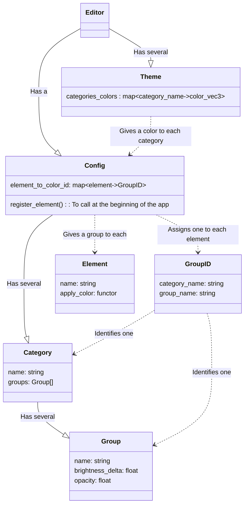

## Architecture

A color (vec3) will be assigned to each `Category`. Then the `Group`s inside that `Category` can tweak its brightness and opacity.

The `Categories` defines groups of colors. Then the `Config` maps `Element`s to one of the `Group`s of one of the `Category`s of the `Families`.

Finally, a `Theme` gives colors to each of the `Category`s.

**`Editor` is the high-level user-facing class that joins everything together.**

