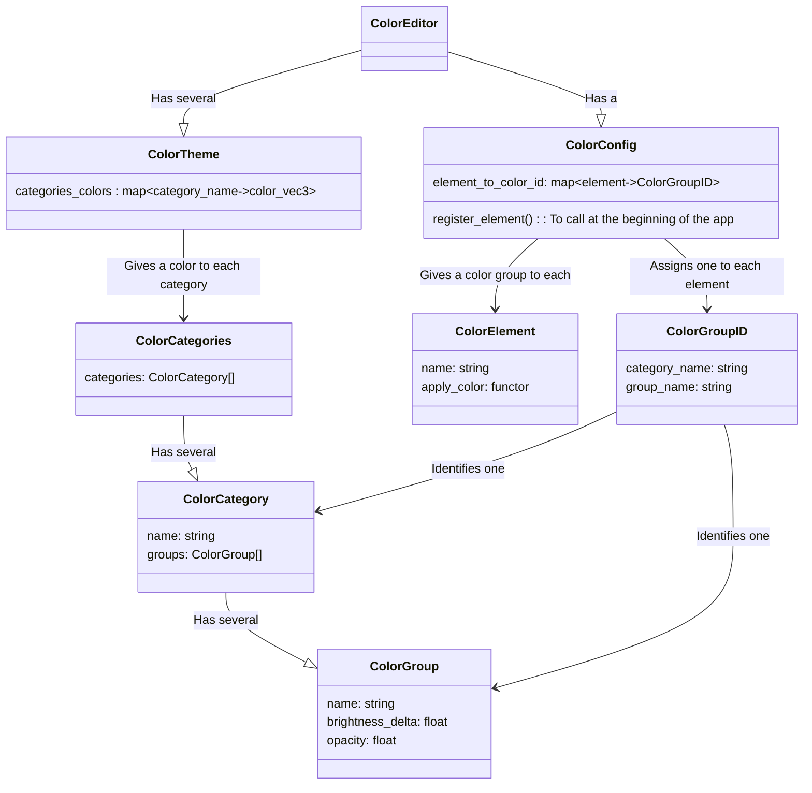

## Architecture

A color (vec3) will be assigned to each Category. Then the Groups inside that Category can tweak its brightness and opacity.

The `ColorCategories` defines groups of colors. Then the `ColorConfig` maps `ColorElement`s to one of the `ColorGroup`s of one of the `Colorcategory`s of the `ColorFamilies`.

Finally, a `ColorTheme` gives colors to each of the `ColorCategory`s.

**`ColorTheme` and `ColorConfig` are the high-level user-facing classes.**

